# Shore Chapters: a Three.js + Rapier foundation

A modular boilerplate for a chapter-based mini-game. The art direction is a stylised, atmospheric look inspired by
DON'T NOD's _Jusant_, and the setting is a beach, the open Atlantic and an old-town square modelled on Guimarães,
Portugal. It covers:

- **Look**: a "ray-traced likeness" on a WebGL budget. Stylised PBR (`MeshStandardMaterial` patched through
  `onBeforeCompile`) is lit by a warm sun with 4096² contact-hardening soft shadows and image-based lighting from a
  low-frequency procedural sky, instead of ambient lights. Walkable ground has baked vertex AO, plus screen-space AO,
  subtle bloom, SMAA and a warm/cool 3D LUT. The gradient sky blends into `FogExp2` and an analytic height fog, and wind
  is prominent (curling streaks, pooled dust, pollen and sea spray, swaying foliage, flags).
- **Materials and detail**: every surface has a procedurally synthesised PBR texture set. The sets include granite
  ashlar, weathered stucco, worn setts, sandstone slabs, clay roof tiles, planks, louvred shutters, panelled doors, glazed
  windows, azulejos, cast iron, bark, terracotta, fabric weave, tyre tread and leather. Each set has an albedo map and a
  detail map carrying normal, roughness and cavity, generated in Web Workers at startup with no downloads. Houses
  have dressed quoins, stepped cornices, sills, lintels, iron grilles, shutters, flower boxes, gutters, downpipes, ridge
  tiles and chimney pots. Garments carry procedural fabric relief (weave, twill, rib knit, leather, satin folds, hair
  strands).
- **Physics** ([Rapier](https://rapier.rs)): a sand heightfield that matches the shader-displaced dunes, a Gerstner
  ocean with buoyancy sampled from the same waves, a slanted cobbled plaza, an arcaded town hall and narrow streets
  built from grouped static colliders, and a raycast car with a drivetrain.
- **Character**: a component-based FSM covering idle/walk/run blending, jumping, sitting on benches and tavern
  tables, lying on beach towels, and entering, driving and leaving the car. The body is a smooth, lofted skinned mesh
  that morphs between masculine and feminine profiles without breaking skinning. A wardrobe swaps garments built on the
  same skeleton: skin-tight shells with GLSL cut-outs, Verlet skirts and hems layered over each other, a silver dress
  with GPU flow and leg push-out, and spring-bone hair and scarf.
- **World depth**: ivy, rubble, crates, ceramic planters, cloth banners and pennants in the old town; pebbles,
  driftwood and a shoreline that grades from dry sand through damp and wet to a reflective swash film.

| | | |
|---|---|---|
| 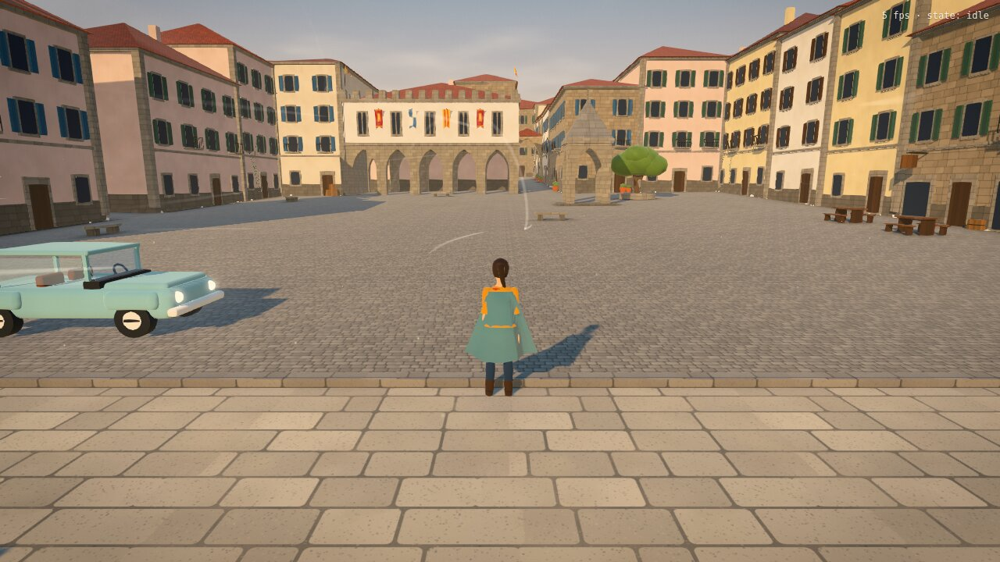 | 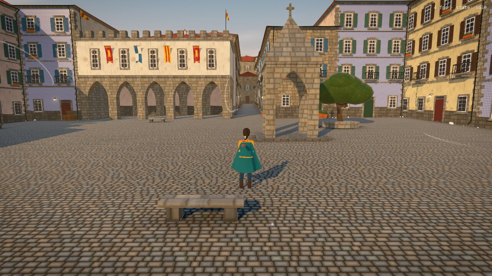 | 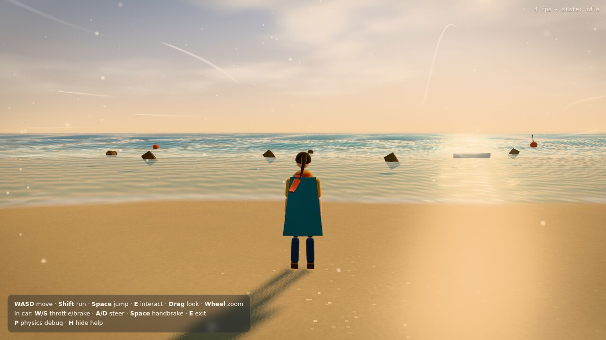 |
| 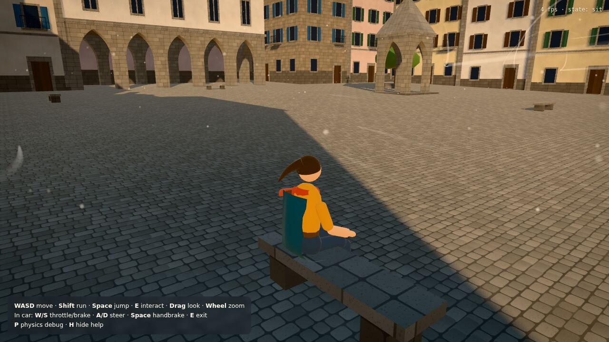 | 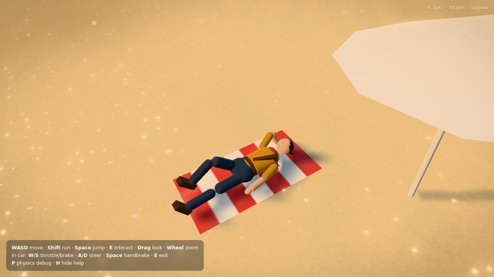 | 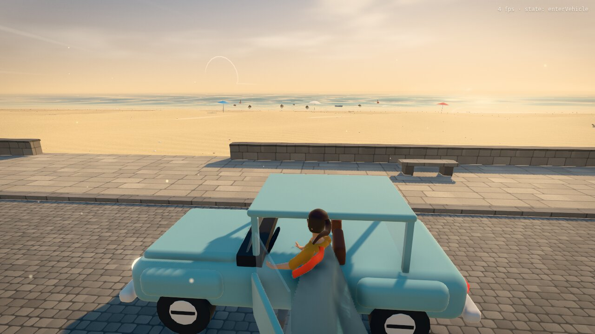 |
| 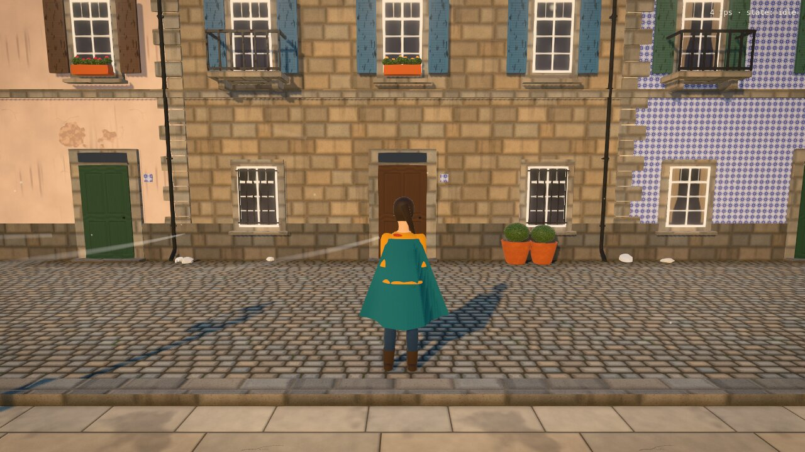 | 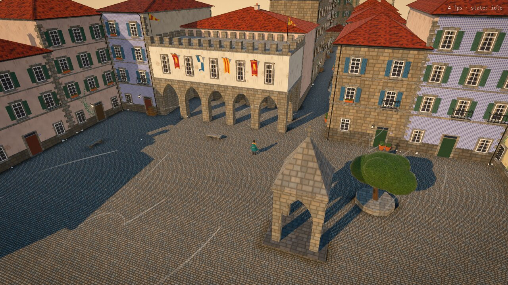 | 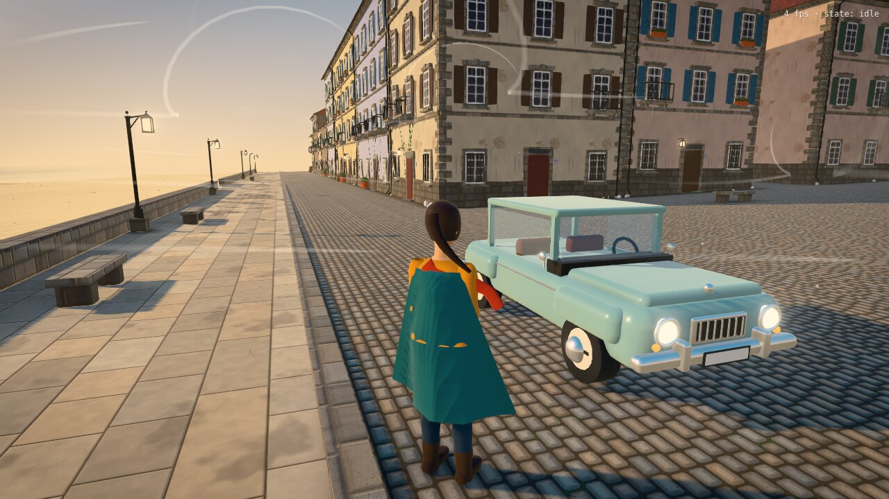 |

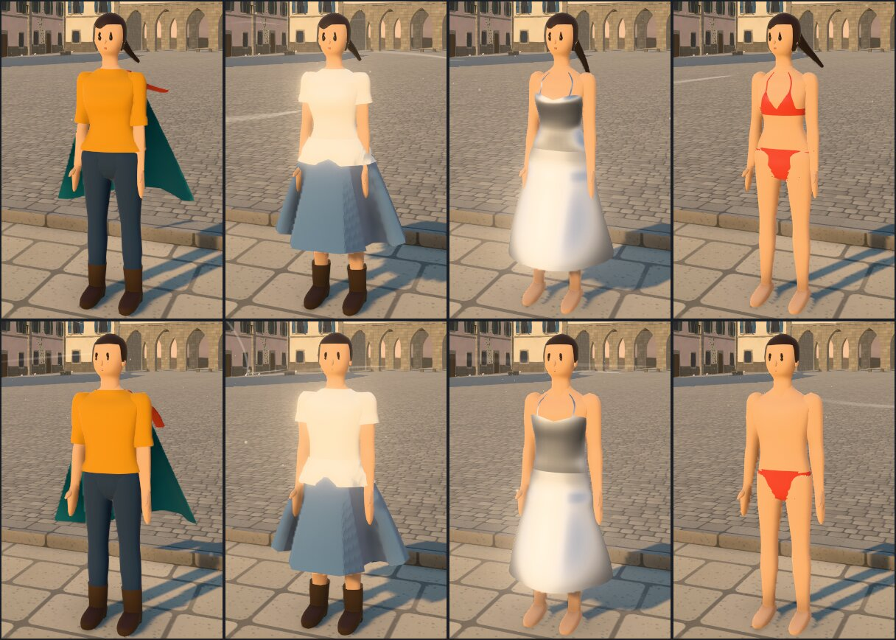

_Screenshots are from headless Chromium with software WebGL (SwiftShader), so the fps counter is not representative._

## Authored heroine (Blender pipeline)

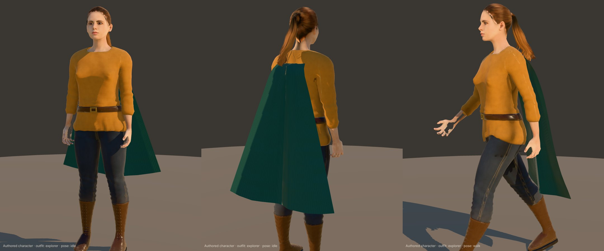
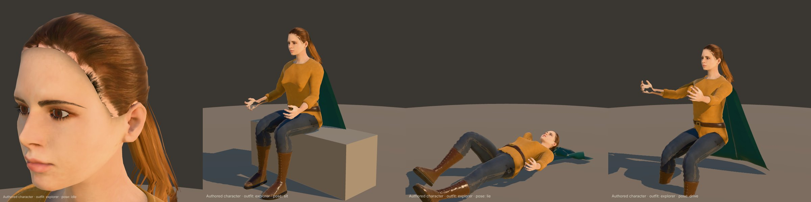

The player character is now an authored, realistic heroine built in Blender and loaded as a glTF
(`public/assets/characters/heroine.glb`). The procedural body is still there as a fallback (set
`CHARACTER.asset = null` in `config.js`, or when the file is missing) and for the masculine↔feminine morph.

**Pipeline** (`art/blender/scripts/`, Blender 4.5 + the MPFB 2 extension with the CC0 MakeHuman asset packs):

| Script | Role |
|---|---|
| `heroine_pipeline.py` | `CONFIG` (height, body macros, face targets, skin, eyes, hair…) and the two stages: **source** builds the MPFB human (`heroine_mpfb_source.blend`, still editable in MPFB); **game** poses her into the game's bind pose, builds the 17-joint game skeleton with merged weights plus `hair0…hair3` ponytail joints, the outfit, the bakes and the body coverage, then exports the GLB and `heroine_game.blend` |
| `garments.py` | garment toolkit: grow cloth from body regions, drape against a smoothed body proxy, gravity "hang", belt cinch, soft push-out, folds, thickness, weight smoothing |
| `explorer_outfit.py` | the outfit, parameterised by the body's joints: tunic, belt and brass buckle, canvas trousers, laced boots with rubber soles |
| `outfit_looks.py`, `materials.py`, `heroine_textures.py` | procedural Cycles look-dev in object space (fabric mottling, wear, grime, double-stitched seams and hems from distance fields, laces, eyelets, welt stitching), baked to albedo × AO, normal and roughness maps in `art/blender/textures/` |

To tailor her (face, hair, height, skin…), edit `CONFIG` and run `heroine_pipeline.py` from Blender's Text Editor
(`HEROINE_STAGE=game` skips rebuilding the source). Stage 2 takes about 1.5 minutes.

**In the game** (`src/character/CharacterAsset.js`): only the glTF joint *positions* are used. `CharacterMesh`
rebuilds its skeleton with identity rest rotations at those joints (the convention all `CharacterRig` poses use) and
rebinds the meshes to it, so Blender bone rolls never matter. The animator's proportions (pelvis height, kneeling
height, arm spread) come from the skeleton. Authored garments are `asset` wardrobe items. The body's `_COVER` vertex
attribute marks skin hidden by each outfit channel and is discarded in the skin shader, which replaces region hiding.
The ponytail is a spring-bone chain on the authored joints, and the cloak is still Verlet cloth. Its pins are sampled
on the authored body by ray-casting the torso, and its colliders are capsules derived from the joints.

**Character viewer**: `npm run dev` → `http://localhost:5173/viewer.html` shows the character stack with the game's
materials and sky light, without the world. Keys 1–8 switch poses (idle, walk, run, jump, sit, kneel, lie, drive),
**O** cycles outfits and **T** toggles a turntable. `?procedural` shows the procedural body instead.

Credits: body, skin, eyes, brows, lashes, teeth and hair come from MakeHuman / MPFB (CC0). The outfit, textures and
rig conversion were made for this project.

## Quick start

```bash
npm install
npm run dev       # Vite dev server
npm test          # headless physics / FSM test suite (Node ≥ 20)
npm run build     # production build in dist/
```

Requires WebGL2. Assets are procedural, so the project has no downloads beyond npm packages.

### Controls

| On foot | In the car |
|---|---|
| **WASD** move (camera-relative), **Shift** run, **Space** jump | **W** throttle, **S** brake (hold at standstill to reverse) |
| **E** interact (sit, lie down, drive); **E**/move to get up | **A/D** steer, **Space** handbrake, **E** exit (below ~9 km/h) |
| **Drag** orbit camera, **Wheel** zoom | **P** physics debug lines, **H** toggle help |
| **O** cycle outfit, **G** morph body profile | |

## Architecture

```
src/
├─ main.js                      bootstrap: Rapier → Engine → global services → chapter
├─ config.js                    palette, render/physics constants, collision layers, bindings, layout
├─ core/
│  ├─ Engine.js                 renderer, composer (render → AO → bloom → grading → output → LUT → SMAA), fixed-step loop
│  ├─ PhysicsWorld.js           Rapier wrapper: interpolation links, scopes, grouped static colliders, queries
│  ├─ Input.js                  action-based input with frame-aware press latching
│  ├─ CameraRig.js              third-person orbit / anchored / vehicle chase, collision-aware
│  └─ ChapterManager.js         Chapter base class (root group, systems, physics scope) + loader
├─ shaders/
│  ├─ StylizedMaterial.js       onBeforeCompile patch of MeshStandardMaterial (wrapped PBR direct light, brush noise, triplanar, vertex AO, rim, wind sway)
│  ├─ common.glsl.js            shared uniforms (sun, sky, wind, time), noise, sky gradient
│  └─ grading.glsl.js           split-toning / saturation / contrast / vignette / grain
├─ lighting/
│  ├─ ShaderPatches.js          global chunk patches: contact-hardening soft shadows, analytic height fog
│  ├─ IBL.js                    procedural sky → PMREM environment (replaces ambient/hemisphere lights)
│  ├─ VertexAO.js               bakes ambient occlusion into ground vertices by ray-casting the Rapier world
│  ├─ StylizedAOPass.js         half-res SAO from the depth buffer + bilateral blur + tinted composite
│  └─ JusantLUT.js              generated 3D LUT: filmic S-curve, hue shifts, split toning
├─ vfx/
│  ├─ ParticleSystem.js         pooled, packed SoA particles in one InstancedMesh (dust, pollen, spray)
│  └─ AtmosphereVFX.js          wind-scaled emitters: drifting dust, city pollen, spray off wave crests
├─ environment/
│  ├─ Environment.js            sun, IBL, fog, sky, wind, sand, ocean, buoyancy, city, dressing, VFX (an Engine system)
│  ├─ Terrain.js                sandHeight() in JS and GLSL, generated from one parameter set
│  ├─ GerstnerWaves.js          wave spectrum, CPU sampler (inverse displacement, orbital velocity), GLSL
│  ├─ Ocean.js                  graded grid mesh + full ocean vertex/fragment shaders
│  ├─ Sand.js                   dune displacement, grain, ripples, glints, dry → damp → wet → swash film + heightfield collider
│  ├─ Buoyancy.js               sample-point Archimedes + drag against the wave orbital velocity
│  ├─ Sky.js / WindSystem.js / WindParticles.js
│  ├─ CityBuilder.js            Guimarães-style square: plaza, arcade, shrine, streets, benches, tavern
│  ├─ CityDressing.js           ivy, rubble, crates, planters (with colliders), Verlet banners and pennants
│  ├─ BeachProps.js             towels (lie-down anchors), parasols, floating crates/barrels/buoys/boat
│  ├─ BeachDressing.js          density-weighted pebbles, driftwood with capsule colliders
│  ├─ MeshBatcher.js            groups placements into InstancedMesh draw calls
│  ├─ TextureFactory.js         texture sets on demand: worker pool, placeholders upgraded in place; painted banners/towels
│  └─ textures/                 TextureSynth.js (periodic noise, height → normal/cavity bake), Patterns.js (the material
│                               library), texture.worker.js
├─ character/
│  ├─ CharacterController.js    entity: components + FSM + intent + KCC bridging helpers
│  ├─ CharacterAsset.js         authored glTF character: joints, parts, torso sampling for cloth pins
│  ├─ StateMachine.js           State / StateMachine with an explicit transition table
│  ├─ CharacterBody.js          capsule + KinematicCharacterController, postures, safe-spawn search
│  ├─ CharacterRig.js           pose-vector animator (cross-fades, blend space) driving the CharacterMesh bones
│  ├─ CharacterMesh.js          lofted skinned body, masculine↔feminine morph, body regions, garment builder
│  ├─ body/                     Loft.js (superellipse lofting), BodyProfiles.js (the two profiles)
│  ├─ Wardrobe.js               garments (shell / cloth / dress / spring), outfits, masks, layering
│  ├─ FabricShader.js           procedural fabric relief (bind-space or UV), surface-gradient bump
│  └─ states/                   LocomotionStates, AnchoredStates (sit, lay), VehicleStates
├─ interaction/
│  ├─ InteractionManager.js     spatial-hash proximity, focus scoring, focus events
│  └─ Interactable.js           Interactable + Anchor (local transforms that follow moving objects)
├─ vehicle/
│  ├─ VehicleSystem.js          RaycastVehicle (Rapier controller + extras) and input routing
│  ├─ Drivetrain.js             torque curve (monotone cubic), auto gearbox, clutch launch, engine braking
│  └─ CarModel.js               procedural car, door hinge, seat mount, door anchor, exit points
├─ simulation/
│  ├─ VerletCloth.js            PBD cloth: aerodynamics, swept capsule collisions, cloth-over-cloth layering
│  └─ SpringBoneChain.js        VRM-style spring bones + skinned tube helper
├─ chapters/ShoreChapter.js     chapter 1: wires it all together
├─ tools/CharacterViewer.js     dev page (viewer.html): character, outfits and poses without the world
└─ ui/                          HUD (prompt, gauges, toasts) + CSS
tests/                          node --test suites (physics, vehicle, end-to-end FSM, character/wardrobe/VFX/LUT)
```

### Frame loop

`Engine` runs physics at a fixed 60 Hz with an accumulator. It caps sub-steps per frame (`engine.maxSubSteps`) to
avoid a spiral of death:

```
for each fixed step:  systems.fixedUpdate → world.step → systems.postPhysics → capture poses
interpolate linked meshes (alpha = accumulator / dt)
systems.update(frameDt, renderTime) → systems.lateUpdate → composer.render
```

Systems are plain objects ordered by priority: input/debug (-100) → character (0) → vehicles (10) → environment
(20) → camera (50) → HUD (100). `renderTime` is the interpolated simulation time and feeds `uTime`, so the ocean shader
and the CPU buoyancy sampler always agree on where the waves are.

### Key design decisions

**One source of truth for GPU and CPU.** The dunes are displaced in the vertex shader. The physics heightfield,
towel placement, ocean depth and shore attenuation all use the same `sandHeight()`, generated as both JS and GLSL from
`TERRAIN`. The same applies to waves: `GerstnerWaves` emits the GLSL and implements the CPU mirror, including shore
attenuation and per-wavelength distance LOD. In the tests the heightfield deviates from the analytic surface by at
most 4 mm (threshold 5 cm), and the wave inversion residual is about 2 mm (threshold 1 cm).

**Stylised PBR without losing three.js features.** `createStylizedMaterial()` patches `MeshStandardMaterial`
instead of using a raw `ShaderMaterial`, so shadows, fog, IBL, instancing, skinning and tone mapping keep working. The
direct-light model is overridden (`RE_Direct`): GGX specular stays physical, while diffuse uses a wrapped, softly
ramped term with a warm band at the terminator. The material also adds:

- world-space domain-warped brush noise
- triplanar texturing, so scaled instances never stretch
- baked vertex AO applied to indirect light, specular occlusion and, lightly, to direct light
- a sky- or sun-tinted rim light
- optional vertex wind sway

Every variant is expressed through `defines` and the program cache key.

```glsl
void RE_Direct_Stylized(/* three's RE_Direct signature */) {
  float ndl = dot(geometryNormal, directLight.direction);
  reflectedLight.directSpecular += saturate(ndl) * directLight.color
      * BRDF_GGX(directLight.direction, geometryViewDir, geometryNormal, material)
      * material.multiScatteringCompensation;
  vec3 F = F_Schlick(material.specularColor, material.specularF90, saturate(dot(geometryViewDir, halfDir)));
  float wrapped = clamp((ndl + uStyWrap) / (1.0 + uStyWrap), 0.0, 1.0);
  float ramp = mix(wrapped, smoothstep(0.0, uStySoftness, wrapped), 0.75);
  float band = smoothstep(0.0, 0.18, wrapped) * (1.0 - smoothstep(0.18, 0.5, wrapped));
  reflectedLight.directDiffuse += directLight.color * (ramp + band * vec3(0.16, 0.06, -0.02))
      * BRDF_Lambert(material.diffuseContribution) * (1.0 - F);
}
#define RE_Direct RE_Direct_Stylized
```

**Lighting pipeline ("ray-traced likeness").**

- **IBL instead of ambient lights.** `SkyIBL` renders the procedural sky, plus a warm ground bounce, into a
  low-frequency, high-exposure PMREM. That becomes `scene.environment`, so diffuse and specular indirect light come from
  the same sky as the background. Call `Environment.refreshLighting()` after changing the sun.
- **Soft, elongated shadows.** three r186 removed `PCFSoftShadowMap` (it now aliases to PCF with a warning), so
  `ShaderPatches.js` rewrites the PCF shadow chunk instead. Four comparison taps at increasing depth offsets (0.15, 0.6,
  1.5 and 3.5 m towards the light) estimate the blocker distance. A 12-tap Vogel disk then filters with a radius that
  grows with that distance, giving contact-hardening penumbrae: sharp at the feet, soft and long for roofs. The map is
  4096² over ±40 m (about 2 cm texels), follows the player and is texel-snapped. A small depth bias plus a world-space
  `normalBias` remove acne on slopes without detaching contact shadows.
- **Ambient occlusion.** Ground patches bake per-vertex AO by casting hemisphere rays into the Rapier world after all
  colliders exist (`PhysicsWorld.updateQueries()` makes new colliders visible to queries without simulating).
  `StylizedAOPass` adds half-resolution SAO from the depth buffer, with a bilateral blur and a cool-tinted composite.
- **Post chain.** RenderPass (HalfFloat target with depth texture) → SAO → UnrealBloom (strength 0.16, threshold
  0.86) → grading (saturation, contrast, vignette, grain) → OutputPass (Neutral tone mapping, sRGB) → 3D LUT → SMAA.
  The LUT is generated by `JusantLUT.js`: a filmic S-curve, warm-hue saturation, greens nudged to olive/teal, and split
  toning (cool lifted shadows, warm highlights).
- **Height fog.** The fog chunks are overridden under `STY_HEIGHT_FOG`. Fog density decays exponentially with
  altitude, and the integral along the view ray is evaluated analytically, so valleys and the shoreline haze up while
  rooftops stay clear. Fog takes on sun colour when looking towards the sun.

**FSM with an explicit transition table** (`CHARACTER_TRANSITIONS`). States are small scripts that call controller
helpers (`moveGrounded`, `walkTo`, `holdAndFace`, `setRootMode`). Transitions requested mid-update are deferred until
the update returns.

```
idle ⇄ walk ⇄ run ─┬─► airborne ─► idle/walk/run
                   ├─► sit         (approach → turn → settle → seated → standUp) ─► idle
                   ├─► layDown     (approach → turn → kneel → lie → lying → getUp → rise) ─► idle
                   └─► enterVehicle (approach → open → getIn) ─► drive ─► exitVehicle (door → findSpot → getOut) ─► idle
```

**Anchors.** Interactions snap to anchor matrices stored relative to an `Object3D`, so they follow moving vehicles.

| Anchor type | Origin and orientation |
|---|---|
| Seat | Pelvis contact point on the seat, +Z facing; carries `seatHeight` |
| Towel | Towel centre on the ground, +Y along the sand normal, head towards −Z |
| Door | Ground outside the door, +Z facing the car |

Approaches walk around props, so a bench approached from behind is handled. Stand-up and vehicle exit pick a free
spot by ground-probing and testing the capsule against candidate positions.

**Postures.** The capsule changes shape per state. Standing uses the KCC (slopes up to 48°, 0.38 m autostep, ground
snapping, pushing props). Seated parks a shorter capsule on the seat. Lying uses a horizontal capsule aligned to the
towel axis and the sand normal. In a vehicle the capsule is disabled and the rig is parented to the seat mount.

**Modular character mesh.** `CharacterMesh` lofts superellipse cross-sections along limb and torso frames, using
Catmull-Rom keys for smooth, low-frequency curves, thick hands and feet. The result is a single `SkinnedMesh` with
about 7.6k vertices and 15k triangles. Both body profiles are lofted with identical topology. The feminine shape is
stored as a morph target in *masculine bind space* (each vertex minus its skin-weighted bone offset), and bone rest
positions blend with the same factor. At any blend the rest pose is exactly `lerp(masc, fem, f)` (tested to < 0.01 mm),
so linear blend skinning and every animation keep working while morphing. The index is sorted into one geometry group
per body region (hips, belly, chest, thighs…), and `setHiddenRegions()` flips groups to an invisible material, so
garments hide what they cover instead of fighting it in the depth buffer.

**Wardrobe.** Garments are built on the same skeleton and morph:

| Kind | Used for | How it stays on the body |
|---|---|---|
| `shell` | tunic, trousers, boots, shirt, bikini, bodice, hair | lofted over body segments with an inflation offset, same skin weights and morph as the body; optional GLSL cut-out mask evaluated on body-surface coordinates |
| `cloth` | skirt, shirt hem, cloak | Verlet cloth pinned to skinned surface samples; collides with body capsules inflated per layer, and `over` keeps an outer layer radially outside an inner one |
| `dress` | silver dress skirt | skinned bell; vertex shader adds flow waves, inertia and wind drift, then pushes vertices out of the leg capsules |
| `spring` | ponytail, scarf | VRM-style spring bones colliding with head and chest spheres |

Outfits (`explorer`, `skirtShirt`, `silverDress`, `bikini`) switch by diffing the equipped set, so shared items keep
their simulation state. Items can be limited to one profile; the masculine "bikini" is just the bottoms. The
skirt-and-shirt outfit is two physical layers: the hem is pinned above and outside the skirt's waistband, each layer
collides with the body capsules at its own margin, and the layering constraint keeps the hem outside the skirt. Cloth
damps velocity *relative to its pins*, so walking doesn't drag it through a fake headwind; real air resistance comes from
the aerodynamic term. The dress anti-clipping is a GPU distance constraint:

```glsl
// after #include <skinning_vertex>, mesh-local space
for (int i = 0; i < 4; i++) {                       // thighs + shins, inflated by the fabric clearance
  vec3 ab = uCapB[i] - uCapA[i];
  float h = clamp(dot(transformed - uCapA[i], ab) / max(dot(ab, ab), 1e-6), 0.0, 1.0);
  vec3 d = transformed - (uCapA[i] + ab * h);
  float dist = length(d);
  if (dist < uCapR[i]) transformed = uCapA[i] + ab * h + d / max(dist, 1e-4) * uCapR[i];
}
```

The silver fabric is high-metalness, fairly rough PBR. A soft sky IBL alone makes such a metal read as flat white
satin, so a fragment patch reshapes its indirect specular with a stylised "studio" gradient keyed on the world-space
reflection vector: a dark ground, a bright horizon band and a dimmer zenith, with band width scaling with roughness.

**Procedural texture sets.** `textures/Patterns.js` authors each material as fields over the unit tile: a height,
an albedo and a roughness factor, built from periodic value and cellular noise, running-bond layouts and random-walk
cracks. `TextureSynth.bake()` derives the rest physically. The normal comes from height differences scaled by the real
relief depth over the texel size, so a 1 cm mortar joint reads the same on a 2 m tile as on a 3 m one. The cavity is
the height minus its local blur. The result is two RGBA8 maps: albedo (sRGB) and a detail map (RG normal, B
roughness / 2, A cavity). Albedo stays near white wherever the hue comes from the material colour, so one granite set
serves light and dark stone. Generating everything takes about 3.7 s of single-threaded JS, so `TextureFactory` runs
it in a small worker pool. `set(name)` returns full-size textures immediately (flat placeholders), and the generated
buffers are copied in when they arrive, so world building never waits.

`StylizedMaterial` reads the detail map in one of three modes:

- **triplanar**: world-space, with each projection's height gradient mapped straight onto the surface (UDN blend), for
  stone, stucco, ground, wood, iron and foliage
- **roof-plane**: u runs along the eave and v up the slope, from each face's normal, so tile courses follow all four
  faces of a hip roof (a triplanar top projection would run them up the slope on two faces)
- **UV**: with a derivative-based tangent frame, for doors, shutters, windows, tyres, seats and fabric

Roughness is multiplied per texel, so glazed tiles, window panes and worn sett tops are glossy while mortar, grout and
chipped paint stay matte. Cavity darkens the albedo in joints, cracks and grain.

**Architectural detail.** Placements are cheap because `MeshBatcher` instances them, so houses carry real geometry:
alternating long and short quoins, a three-course stepped cornice, ridge tiles along the hips, chimney caps with
terracotta pots, eave gutters with offset downpipes, shoes and wall clips, sills, lintels with keystones,
wrought-iron grilles, louvred shutters, corbelled balconies, flower boxes with geraniums, panelled doors with
fanlights, thresholds, knobs and tiled house numbers, wall lanterns, and the occasional fully azulejo-clad façade.
Decoration draws from its own RNG, so it never reshuffles the layout RNG (house sizes, floors, materials). Lamp posts
have a granite pedestal, a column with collars, a scrolled arm and a caged lantern. The car has chrome bumpers with
overriders, a grille, ringed headlamps, indicators, plates, mirrors, wipers, hubcaps, treaded tyres and leather seats.
The beach has ribbed scallop and cockle shells, mussels and strands of wrack along the tide lines.

**Fabric relief.** Skinned garments have no stable UVs, so `FabricShader` evaluates patterns on the *bind-pose*
`position` attribute. That position is stable under skinning, so the weave sticks to the cloth however the character
moves, and 2D weaves are projected on the bind-space normal. Verlet cloth uses its UVs scaled to metres instead. The
height (in metres) becomes a normal through Mikkelsen's surface-gradient bump, unnormalised so the relief is physical.
Each octave fades by its frequency × pixel footprint: weaves show in close-ups and never alias at distance, while the
broad wrinkles carry the read at gameplay range.

**World depth.** `ParticleSystem` keeps particles packed at the front of preallocated structure-of-arrays typed
arrays. Spawning appends, and killing swaps the last live particle into the hole, so updates never allocate. One
`InstancedMesh` draws every type, uploading only the live range. Emission is scaled by the global wind strength. Spray
spawns on wave crests in the breaking zone and dies when it falls back below the CPU wave height. Flags and banners are `VerletCloth`
pinned to their poles, simulated only within 95 m of the camera. Sand dampness is computed in the sand shader from the
same Gerstner waves as the ocean: a reflective swash film, wet sand inside the swash envelope, a damp band, and noisy damp
patches, each with its own albedo and roughness.

**Vehicle.** Rapier's `DynamicRayCastVehicleController` handles suspension, contacts and the friction circle.
`RaycastVehicle` adds on top:

- a torque curve and automatic gearbox, with clutch slip at launch, engine braking, a rev limiter and a limited
  reverse
- front-biased brakes in newtons, clamped to μ·N because Rapier doesn't limit brake impulses by grip
- a handbrake that unloads rear lateral grip
- per-wheel surface grip read from collider metadata (sand vs stone)
- anti-roll bars, aerodynamic drag and speed-sensitive steering
- a configurable `rollInfluence`. Rapier hard-codes Bullet's 0.1, which corners almost flat. At 1.0 (fully
  physical) the car rolls about 2° at roughly 0.9 g without anti-roll bars, matching a hand calculation. The default of
  0.55 plus anti-roll bars gives about 1°.

**Collision layers** (`config.js`): STATIC, CHARACTER, VEHICLE, DYNAMIC and BOUNDS. Invisible bounds stop only the
player and car. Camera rays only see static geometry, and wheel rays skip the car's own chassis.

**Performance.** The old town's 50 houses (about 12,000 placed parts: walls, quoins, cornices, windows, shutters,
grilles, balconies, gutters, ridge tiles, flower boxes, merlons) collapse into about 50 instanced draw calls, and all
139 city colliders hang off a single fixed body. Procedural textures are generated off the main thread and are
typically ready before the first frame. Wind streaks are fully
GPU-animated, and atmosphere particles are pooled with no per-frame allocation. The sun shadow frustum follows the
player and is texel-snapped. Cloth sub-steps at a fixed rate. On long frames it stretches the sub-step (up to 1/40 s) so
the frame is still simulated in real time, with pins and body colliders swept across the sub-steps; only real hitches
carry rigidly. Distant banners freeze. Rapier's inlined WASM is lazy-loaded in its own chunk.

## Extending

- **New chapter**: subclass `Chapter` and build under `this.root`. Physics objects created during `load()` are scoped
  and freed on unload. Register the chapter in `main.js`.
- **New interaction**: add an `INTERACTION_TYPE`, a state, and an entry in `INTERACTION_STATE` and
  `CHARACTER_TRANSITIONS`.
- **New garment**: add an entry to `WARDROBE_ITEMS` (kind, parts or ring, `hides`, `mask`, `layer`, `over`,
  `profiles`, material) and reference it from an `OUTFITS` preset. Masks are GLSL snippets over `(a, y)`, the angle
  around the body segment and its height.
- **Real character art**: keep `CharacterRig`'s API (`setLocomotion`, `playPose`, `setPoseParams`, `update`, `joints`)
  and drive a GLTF `SkinnedMesh` with `AnimationMixer`. Use a 1D idle/walk/run blend space with synced phase and
  cross-faded clips for poses. Author the second body profile as a morph target in bind space, as `CharacterMesh` does,
  and keep the bone names so the wardrobe's capsules and pins still resolve.
- **New material**: write a pattern in `textures/Patterns.js` (height, albedo, roughness per texel; pick `tileSize`
  and `depth` for physically scaled normals), register it in `TextureFactory` `SETS`, and pass `map` and `detailMap`
  to `createStylizedMaterial`, setting `triplanarScale` to 1 / tile size.
- **Art tuning**: change `PALETTE`, `RENDER` (shadows, IBL, fog and height fog, AO, bloom, grading, LUT), `JUSANT_GRADE`,
  `WORLD.sun`, `CHARACTER` (start profile and outfit) and the per-material options in `CityBuilder._createAssets()`.
- **Physics tuning**: `RaycastVehicle` `cfg`, `Drivetrain` options, `POSTURE`, `CharacterController` speeds and
  accelerations, `WAVE_SPECTRUM` and `TERRAIN`.

## Known limitations

- Animation is still the procedural pose-vector animator (no foot IK or authored clips), now driving the authored heroine. Her
  only outfit so far is the explorer one: the other procedural outfits (skirt, silver dress, swimwear) still need Blender versions. Garments
  collide with body capsules, not with each other, except for explicit `over` layering, and the dress's displaced
  vertices keep their skinned normals.
- Approach pathing uses one side waypoint. Swap in a navmesh for complex layouts.
- Only keyboard and mouse are supported, although `Input` is action-based so gamepad support is a mapping away.
- The ocean has no screen-space refraction or reflections, by design for the painted look. The shadow map is a single
  player-centred cascade, and the AO pass is screen-space (no off-screen occluders).
- There is no TAA; SMAA plus the soft lighting keeps aliasing low, but thin geometry such as railings and straps can
  shimmer in motion.
- The texture sets use about 75 MB of GPU memory (five 1024² sets, the rest 512² or 256², with mipmaps). Lower the sizes
  in `TextureFactory` `SIZES` and the matching `Patterns` defaults for low-memory targets. Triplanar stone and stucco can
  show their 2–3 m repeat on long, flat façades.
